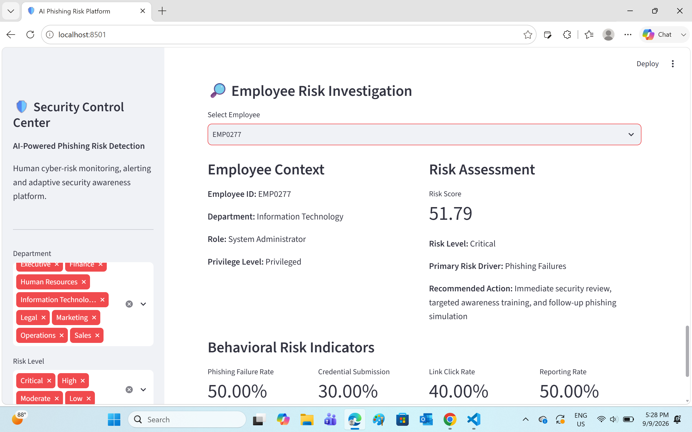

# AI-Powered Phishing Risk Detection & Adaptive Security Awareness Platform

An enterprise-style cybersecurity analytics platform that evaluates simulated employee phishing behavior, calculates human cyber-risk scores, applies machine learning for risk prediction, generates security alerts, and assigns adaptive security awareness training.

## Project Overview

Phishing attacks frequently exploit human behavior rather than technical vulnerabilities. This project demonstrates how security teams can transform phishing simulation data into measurable employee cyber-risk intelligence.

The platform analyzes employee and phishing-event data to identify behavioral risk patterns and produces actionable information for SOC, GRC, and security awareness teams.

## Key Capabilities

- Simulates employee phishing interactions and security behaviors
- Engineers behavioral security features from phishing-event data
- Calculates dynamic employee risk scores
- Classifies employees into risk levels
- Trains and evaluates machine-learning models for risk prediction
- Generates automated alerts for high-risk employees
- Assigns adaptive security-awareness training based on risk
- Stores security analytics data using SQLite
- Provides an interactive Streamlit dashboard
- Includes automated unit and integration testing

## Architecture

The platform follows an end-to-end security analytics pipeline:

Employee Data + Phishing Simulations  
↓  
Data Validation & Preprocessing  
↓  
Behavioral Feature Engineering  
↓  
Risk Scoring Engine  
↓  
Machine Learning Models  
↓  
Security Alert Engine  
↓  
Adaptive Training Assignment  
↓  
SQLite Database  
↓  
SOC/GRC Streamlit Dashboard

## Technology Stack

**Programming & Data**
- Python
- Pandas
- NumPy

**Machine Learning**
- Scikit-learn
- Random Forest
- Gradient Boosting
- Model evaluation and feature analysis

**Security Analytics**
- Behavioral risk scoring
- Phishing susceptibility analysis
- Automated high-risk alerting
- Adaptive security awareness training

**Application & Storage**
- Streamlit
- SQLite

**Testing & Engineering**
- Pytest
- Git
- GitHub
- Python virtual environments

## Project Structure

```text
AI-Phishing-Risk-Platform/
│
├── dashboard/              # Streamlit SOC/GRC dashboard
├── data/                   # Raw and processed security datasets
├── models/                 # Trained ML models and metadata
├── reports/                # Alerts and model evaluation results
├── src/
│   ├── alerts/             # Automated security alert generation
│   ├── data_generation/    # Synthetic employee/phishing data
│   ├── database/           # SQLite database initialization
│   ├── ml/                 # ML training and evaluation pipeline
│   ├── preprocessing/      # Validation and feature engineering
│   ├── risk_engine/        # Employee cyber-risk scoring
│   └── training/           # Adaptive training assignment
│
├── tests/                  # Unit and integration tests
├── requirements.txt
├── .gitignore
└── README.md

Risk-Based Security Workflow

The platform evaluates behavioral indicators such as phishing interactions, credential-submission behavior, reporting activity, training performance, and employee context.

These signals are transformed into a risk score and corresponding risk level. Higher-risk employees can trigger security alerts and receive prioritized security-awareness training.

This demonstrates a practical human-risk management workflow that connects:

Detection → Risk Quantification → Alerting → Security Intervention

Machine Learning

The project includes multiple machine-learning approaches for employee phishing-risk analysis, including:

Baseline model
Random Forest
Gradient Boosting
Feature preprocessing
Model comparison and evaluation
Saved model artifacts for reproducibility
Automated Security Response

The alert engine identifies employees requiring security attention based on calculated risk.

Critical-risk cases can generate prioritized alerts, while the training engine automatically assigns security-awareness modules according to employee risk level and training priority.

Testing

The project includes automated tests covering:

Risk-score calculations
Risk classifications
Security-alert generation
Adaptive training assignments
Database connectivity
Cross-component integration
End-to-end employee risk workflows

The implemented test suite has successfully passed all current automated tests.

Security & Privacy

This portfolio project uses simulated/synthetic employee and phishing data. It is designed for educational and defensive cybersecurity purposes and does not require real employee credentials or confidential organizational information.

Runtime databases, environment files, secrets, Python virtual environments, and temporary development artifacts are excluded from version control where applicable.

Business Value

The platform demonstrates how organizations can move beyond simple phishing click-rate reporting toward continuous human cyber-risk management.

Security teams can use this type of architecture to:

Identify employees and departments with elevated phishing risk
Prioritize security-awareness resources
Automate high-risk escalation
Track behavioral security indicators
Support SOC and GRC risk-monitoring activities
Apply data-driven security interventions

## Dashboard

### Employee Critical-Risk Investigation

The Streamlit dashboard provides SOC/GRC analysts with an employee-level investigation view combining behavioral phishing indicators, calculated risk scores, risk classification, and recommended security actions.



## Project Status

**Core platform implementation complete.**

The repository contains the end-to-end data pipeline, behavioral risk engine, machine-learning components, automated alerting, adaptive training logic, database integration, dashboard implementation, and automated testing framework.

### Automated Testing

The platform includes an automated test suite covering the behavioral risk engine, adaptive training engine, security alert generation, and end-to-end component integration.

**Test Result: 34/34 tests passed**

Run the test suite with:

```bash
python -m pytest tests -v
```

## Author

**Beulah Lam**

Cybersecurity & Information Assurance